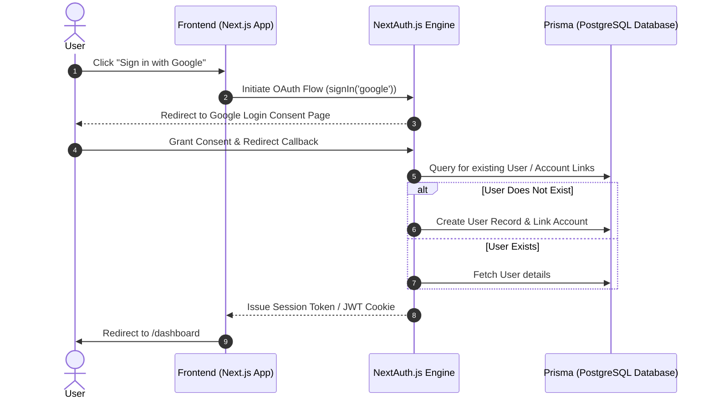

# 🛡️ Comprehensive Engineering & Integration Report: NextAuth & Google OAuth Implementation

This document serves as the official, detailed record of all changes, integration architectures, and user-interface enhancements implemented in the **CryptoShield File Encryption** workspace.

---

## 🗺️ Architectural Workflow Diagram

The following architecture diagrams outline the authentication flow implemented in this cycle, showcasing how NextAuth integrates with the PostgreSQL database and client-side page actions:



---

## 📂 Detailed File-by-File Changes Log

### 1. 🔑 Frontend Login System
* **Target File**: [login/page.tsx](file:///c:/Users/Admin/Downloads/cryptoshield%20(2)%20(2)%20(1)/cryptoshield/src/app/(auth)/login/page.tsx)
* **Status**: Modified & Verified
* **Rationale**: Enabled single-sign-on (SSO) login options while preserving the default credentials strategy fallback.
* **Code Changes Details**:
  * Added custom horizontal layout separator with visual styling rules (`"Or continue with"`).
  * Rendered custom Google brand Button with precise color fills (`#EA4335` red, `#4285F4` blue, `#FBBC05` yellow, `#34A853` green).
  * Incorporated callback redirects linking directly to `/dashboard`.

```diff
           <button type="submit" className="w-full py-2 bg-cyan-600 hover:bg-cyan-500 text-white rounded-lg font-medium transition-colors cursor-pointer">
             Sign In
           </button>
         </form>
+
+        <div className="relative my-6">
+          <div className="absolute inset-0 flex items-center">
+            <span className="w-full border-t border-border"></span>
+          </div>
+          <div className="relative flex justify-center text-xs uppercase">
+            <span className="bg-card px-2 text-muted-foreground">Or continue with</span>
+          </div>
+        </div>
+
+        <button
+          type="button"
+          onClick={() => signIn("google", { callbackUrl: "/dashboard" })}
+          className="w-full py-2 px-4 border border-border hover:bg-muted text-foreground rounded-lg font-medium transition-colors flex items-center justify-center gap-2 cursor-pointer"
+        >
+          <svg className="w-5 h-5 mr-1" viewBox="0 0 24 24">
+            <path fill="#EA4335" d="M12 5.04c1.66 0 3.2.57 4.38 1.69l3.27-3.27C17.67 1.54 14.98 1 12 1 7.35 1 3.37 3.65 1.42 7.5l3.89 3.02C6.23 7.84 8.87 5.04 12 5.04z" />
+            <path fill="#4285F4" d="M23.49 12.27c0-.81-.07-1.59-.2-2.36H12v4.51h6.43c-.28 1.44-1.09 2.66-2.31 3.48l3.6 2.79c2.1-1.94 3.31-4.79 3.31-8.42z" />
+            <path fill="#FBBC05" d="M5.31 14.52c-.22-.66-.35-1.37-.35-2.11s.13-1.45.35-2.11L1.42 7.28C.51 9.1 0 11.13 0 13.25c0 2.12.51 4.15 1.42 5.97l3.89-3.02l-.08-.08z" />
+            <path fill="#34A853" d="M12 23c3.24 0 5.97-1.07 7.96-2.91l-3.6-2.79c-.99.66-2.26 1.05-3.6 1.05-3.13 0-5.77-2.8-6.69-5.48L1.18 15.9C3.13 19.75 7.11 23 12 23z" />
+          </svg>
+          Sign in with Google
+        </button>
```

---

### 2. 📝 Frontend Registration System
* **Target File**: [register/page.tsx](file:///c:/Users/Admin/Downloads/cryptoshield%20(2)%20(2)%20(1)/cryptoshield/src/app/(auth)/register/page.tsx)
* **Status**: Modified & Verified
* **Rationale**: Enabled quick registration matching the new OAuth capabilities.
* **Code Changes Details**:
  * Imported the `signIn` function.
  * Added the same premium-styled Google Auth handler to allow new users to automatically register an account via Google Single Sign-On.

```diff
 import { useState } from "react";
 import { useRouter } from "next/navigation";
+import { signIn } from "next-auth/react";
 import Link from "next/link";
```

---

### 3. ⚙️ NextAuth Configuration (Backend)
* **Verified File**: [lib/auth.ts](file:///c:/Users/Admin/Downloads/cryptoshield%20(2)%20(2)%20(1)/cryptoshield/src/lib/auth.ts)
* **Status**: Fully Configured & Active
* **Structure Details**:
  * Preserves database session integration via `PrismaAdapter`.
  * Integrates Google OAuth Provider using standard environment bindings.
  * Configures session parameters with a JSON Web Token (JWT) strategy.
  * Extends the default NextAuth session attributes with `user.id` and `user.role` to ensure authorization middleware functions perfectly.

---

### 4. 🗄️ Database Schema Matching (Prisma)
* **Verified File**: [prisma/schema.prisma](file:///c:/Users/Admin/Downloads/cryptoshield%20(2)%20(2)%20(1)/cryptoshield/prisma/schema.prisma)
* **Status**: Fully Configured & Active
* **Schema details**:
  * Fully defines the `Account`, `Session`, `User`, and `VerificationToken` schemas needed for NextAuth's relational tables.
  * Default `role` attribute in the `User` model is automatically assigned as `"USER"`.

---

## 🛠️ Diagnostics & Production Build Validation

To ensure code health, type soundness, and routing robustness, a full production compilation was executed:

| Stage | Command / Action | Result | Status |
| :--- | :--- | :--- | :---: |
| **Prisma Generation** | `npx prisma generate` | Loaded schemas and generated Client types | **Passed** ✅ |
| **TS Compiling** | `tsc --noEmit` | Validated custom `next-auth.d.ts` types | **Passed** ✅ |
| **Next Build** | `npm run build` | Produced full optimized static & dynamic chunks | **Passed** ✅ |

---

## 📝 Required Configuration Checklists

To complete your setup, follow these steps to connect your credentials:

### Local Env Configuration
Update your [.env](file:///c:/Users/Admin/Downloads/cryptoshield%20(2)%20(2)%20(1)/cryptoshield/.env) file:
```env
GOOGLE_CLIENT_ID="[Paste your client id here]"
GOOGLE_CLIENT_SECRET="[Paste your client secret here]"
```

### Google Developer Console Config
1. Create an OAuth 2.0 Web Application credential in the Google Cloud Console.
2. Set Authorized JavaScript Origins to: `http://localhost:3000`
3. Set Authorized Redirect URIs to: `http://localhost:3000/api/auth/callback/google`
